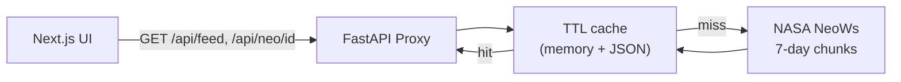

# NASA Near-Earth Object Dashboard (`nasa-dashboard`)

Explore asteroids on close approach using **NASA’s NeoWs** public API. The **Next.js** app never talks to NASA directly: a **FastAPI** backend proxies requests, applies **TTL caching** (memory + JSON files), and **splits long ranges** into 7-day NASA calls.


## Architecture



## Folder structure

```
nasa-dashboard/
├── backend/           # FastAPI + httpx NASA client + cache
│   ├── app/
│   │   ├── main.py
│   │   ├── config.py
│   │   ├── cache.py
│   │   ├── nasa_client.py
│   │   ├── services.py
│   │   ├── schemas.py
│   │   ├── errors.py
│   │   └── routers/
│   ├── tests/
│   └── requirements.txt
├── frontend/          # Next.js App Router + Recharts + Radix/shadcn-style UI
│   ├── app/
│   ├── components/
│   ├── hooks/
│   └── lib/
└── README.md
```

## Backend API (implemented)

| Method | Path | Description |
|--------|------|-------------|
| `GET` | `/api/health` | Liveness check |
| `GET` | `/api/feed?start_date=YYYY-MM-DD&end_date=YYYY-MM-DD` | Aggregated feed for arbitrary range (chunked ≤7 days per NASA call), cached per chunk |
| `GET` | `/api/neo/{asteroid_id}` | Single asteroid detail (`/neo/{id}`), cached |

### Example: feed

```http
GET /api/feed?start_date=2024-01-01&end_date=2024-01-14
```

Response shape (simplified):

```json
{
  "asteroids": [
    {
      "id": "2440012",
      "name": "2002 JE9",
      "nasa_jpl_url": "https://ssd.jpl.nasa.gov/...",
      "is_potentially_hazardous_asteroid": false,
      "close_approach_date_full": "2024-Jan-05 08:12",
      "miss_distance_km": 12345678.9,
      "relative_velocity_kph": 45000.1,
      "estimated_diameter_km_min": 0.12,
      "estimated_diameter_km_max": 0.27
    }
  ],
  "meta": {
    "start_date": "2024-01-01",
    "end_date": "2024-01-14",
    "count": 42,
    "hazardous_count": 3,
    "chunks": 2,
    "cache": { "hits": 1, "misses": 1 }
  }
}
```

### Errors

JSON body: `{ "detail": "human message", "code": "SNAKE_CASE" }`

| HTTP | `code` | When |
|------|--------|------|
| 400 | `INVALID_DATE` | Bad format or `end_date` &lt; `start_date` |
| 400 | `RANGE_TOO_LONG` | Span &gt; `MAX_RANGE_DAYS` (default 90) |
| 429 | `RATE_LIMITED` | NASA rate limit (common with `DEMO_KEY`) |
| 502 | `UPSTREAM_ERROR` | NASA 4xx/5xx body or network failure |
| 404 | `NOT_FOUND` | Unknown asteroid id |

## Caching & chunking (choices)

- **Why not Redis?** For local development and simple deploys, a **process memory cache** plus **on-disk JSON** (under `backend/CACHE_DIR`, default `.cache`) avoids extra infrastructure while still surviving restarts for warm-ish performance.
- **Chunking:** NeoWs allows at most **7 days** per `/feed` request. The backend walks the requested range in **inclusive 7-day windows**, fetches each chunk (with bounded concurrency), merges `near_earth_objects`, and **deduplicates** by asteroid `id` keeping the **closest miss distance** in the window.
- **Keying:** `feed:{start}:{end}` per chunk, `neo:{id}` for details.

## Run locally

### 1. Backend

```bash
cd backend
python3 -m venv .venv
source .venv/bin/activate   # Windows: .venv\Scripts\activate
pip install -r requirements.txt
cp .env.example .env        # optional: set NASA_API_KEY (defaults to DEMO_KEY)
uvicorn app.main:app --reload --port 8000
```

### 2. Frontend

```bash
cd frontend
npm install
cp .env.local.example .env.local
npm run dev
```

Open [http://localhost:3000](http://localhost:3000). Ensure the backend runs on port **8000** or set `NEXT_PUBLIC_API_URL` in `.env.local`.

### Tests (backend)

```bash
cd backend
source .venv/bin/activate
pytest
```

## Frontend features

- Date range picker (warns if &gt; 90 days; backend enforces the same cap).
- Filters: hazardous / non-hazardous, name search, sort by miss distance or estimated size.
- **Recharts:** scatter plot of miss distance vs approach time (optional log Y), size histogram.
- **Detail sheet:** row click → `/api/neo/{id}` via backend with orbital JSON + full close-approach table + JPL link.
- **UX:** skeletons, error banner + Sonner toasts, empty state when filters yield zero rows.

## Trade-offs

- **`DEMO_KEY`** is heavily throttled; use a [NASA API key](https://api.nasa.gov/) in `backend/.env` for smoother UX.
- **Shadcn CLI** was not used here because the remote init registry was unavailable in this environment; UI matches the **shadcn + Radix** patterns via hand-rolled components under `components/ui/`.
- **Deployment** (Railway/Vercel, etc.) is left to you; env vars should live in host secrets, not in git (see `.gitignore`).

## Preview


## License

Data © NASA / JPL-Caltech (NeoWs terms apply). This demo project code is provided as-is for learning.
